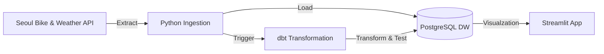

# 🚲 Seoul Bike Flow (Data Engineering Pipeline)


서울시 공공자전거(따릉이)와 기상청 날씨 데이터를 실시간으로 수집, 적재, 가공, 시각화하는 **End-to-End 데이터 파이프라인** 프로젝트입니다.

---

## 1. 🛠 프로젝트 소개 및 기술 스택 (Overview & Tech Stack)

이 프로젝트는 **Modern Data Stack**을 기반으로 구축된 데이터 엔지니어링 파이프라인입니다.
이기종 데이터(자전거 API + 날씨 API)를 결합하여 **날씨가 따릉이 이용률에 미치는 영향**을 분석할 수 있는 기반을 마련했습니다.

### 기술 스택 (Tech Stack)
| 분류 | 기술 | 역할 |
|---|---|---|
| **Ingestion** | **Python**, Tenacity | REST API 호출, 재시도(Retry) 로직 구현, 자동화 스크립트 |
| **Orchestration** | **Apache Airflow** | 데이터 파이프라인 스케줄링, 의존성 관리, Slack 알림 |
| **Storage** | **PostgreSQL** | Raw Data 및 Dimension/Fact 테이블 저장 (Data Warehouse) |
| **Transformation** | **dbt (Data Build Tool)** | ELT의 Transform 담당, 데이터 모델링(Mart 구성), 품질 테스트 |
| **Visualization** | **Streamlit**, Altair | 실시간 대시보드 및 데이터 시각화 |
| **Infra** | **Docker**, Docker Compose | 컨테이너 기반의 환경 격리 및 배포 자동화 |

---

## 2. 🎯 프로젝트 계기와 목적 (Why this project?)

단순히 "데이터를 DB에 넣는 것"을 넘어, 실제 운영 환경(Production)에서 발생할 수 있는 문제들을 기술적으로 해결해보고자 시작했습니다.

1.  **데이터 품질 문제**: API가 언제 깨진 데이터를 보낼지 모릅니다. -> **dbt Data Quality Test**로 방어막을 구축했습니다.
2.  **시스템 안정성**: 네트워크가 불안정하거나 서버가 죽을 수 있습니다. -> Retry(재시도)와 **Slack 알림(Observability)** 시스템을 도입했습니다.
3.  **대용량 데이터 처리**: 데이터가 수백만 건 쌓이면 느려집니다. -> DB Partitioning(파티셔닝)을 통해 조회 속도와 관리 효율을 최적화했습니다.
4.  **복잡한 데이터 결합**: 위경도(GPS) 좌표와 격자(Grid) 좌표가 서로 다릅니다. -> **좌표계 변환 알고리즘**을 직접 구현하여 이기종 데이터를 통합했습니다.

---

## 3. 🏗 아키텍처 및 실행 방법 (Architecture & How to run)

### 시스템 아키텍처


### 실행 방법 (How to run)

**1. 사전 준비**
*   **Docker Desktop**이 설치되어 있어야 합니다.
*   서울시 공공데이터 API 키와 기상청 API 키가 필요합니다.

**2. 환경 변수 설정**
`.env.example` 파일을 복사하여 `.env`를 생성하고 키를 입력합니다.
```bash
cp .env.example .env
vi .env
# SEOUL_DATA_API_KEY, WEATHER_API_KEY, SLACK_WEBHOOK_URL 등 입력
```

**3. 원클릭 실행**
Docker Compose를 통해 모든 서비스(Airflow, Postgres, Streamlit)를 한 번에 실행합니다.
```bash
docker-compose up -d --build
```

**4. 접속 주소**
*   **Airflow UI**: [http://localhost:8080](http://localhost:8080) (ID/PW: `airflow`/`airflow`)
*   **Streamlit Dashboard**: [http://localhost:8501](http://localhost:8501)

---

## 4. 📝 프로젝트 요약 (Summary)

이 프로젝트는 다음과 같은 핵심 엔지니어링 역량을 포함하고 있습니다.

*   ✅ **Reliability (안정성)**: `tenacity`를 이용한 Exponential Backoff 재시도 로직 구현.
*   ✅ **Idempotency (멱등성)**: Airflow `logical_date` 기반의 **Delete-Insert** 패턴으로 중복 데이터 방지.
*   ✅ **Data Quality (품질)**: `dbt test`를 통해 `Not Null`, `Unique`, `Non-Negative` 등 데이터 무결성 검증 자동화.
*   ✅ **Operability (운영 용이성)**: Airflow 태스크 실패 시 **Slack**으로 로그 링크 자동 전송 & 대용량 테이블 **월별 파티셔닝** 적용.
*   ✅ **Integration (통합)**: 서로 다른 주(Grain)와 좌표계를 가진 자전거/날씨 데이터를 하나의 분석 가능한 마트(Mart)로 통합 모델링.
